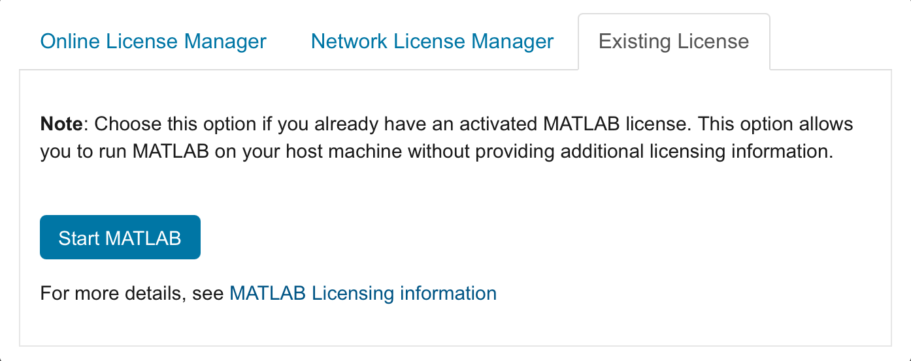
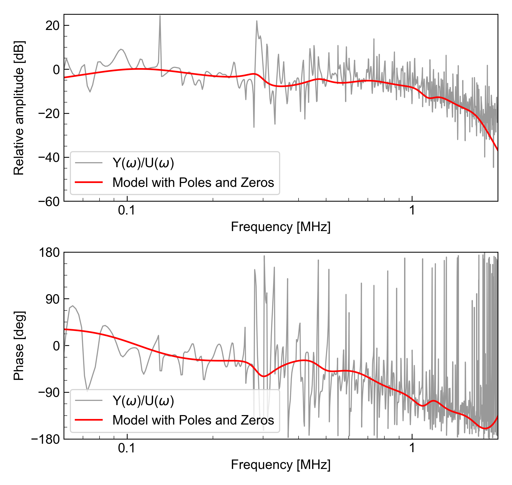
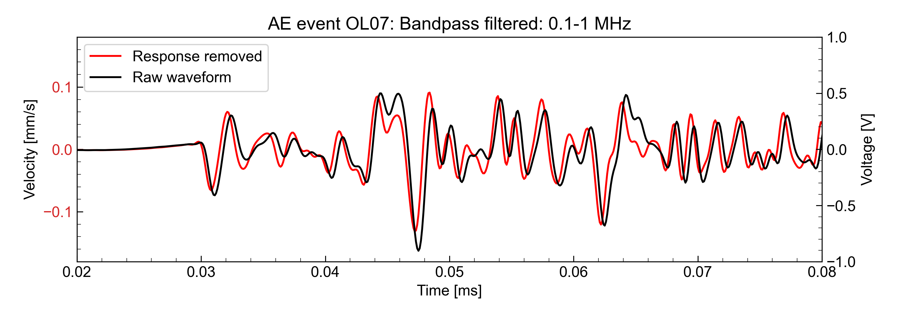

# AEsensor Calibration using ARX model
This repository contains the MATLAB function to conduct the sensor calibration using the autoregressive exogenous model (ARX) model, represented by poles and zeros, and an example to apply the response removal with the ARX model to the AE waveform. Jupyter notebooks are available to perform those processings above.

[](https://github.com/kura-okubo/AEsensor_Calibration_ARX/actions/workflows/test.yml)
[](https://codecov.io/gh/kura-okubo/AEsensor_Calibration_ARX)
[](https://zenodo.org/badge/latestdoi/677228393)


## List of Notebooks


- [01_AEsensor_calibration_arx.ipynb](src/01_AEsensor_calibration_arx.ipynb)
  <a href="https://nbviewer.org/github/kura-okubo/AEsensor_Calibration_ARX/blob/master/src/01_AEsensor_calibration_arx.ipynb" target="_blank">
   
  </a>
  <br>
We conduct the calibration of the AE sensor using  Auto-Regressive eXogenous (ARX) model. We use the measurements of laser Doppler vibrometer (LDV) and the AE sensor as the input and output of the system, respectively.

- [02_Apply_removalresp_to_AEevent.ipynb](src/02_Apply_removalresp_to_AEevent.ipynb)
  <a href="https://nbviewer.org/github/kura-okubo/AEsensor_Calibration_ARX/blob/master/src/02_Apply_removalresp_to_AEevent.ipynb" target="_blank">
   
  </a>
  <br>
We demonstrate the application of the ARX model with poles and zeros to the AE waveform using [src/remove_resp_digitalfilt.py](src/remove_resp_digitalfilt.py).

- [convert_and_save_AEevent_fb03-087.ipynb](src/convert_and_save_AEevent_fb03-087.ipynb)
This notebook preprocesses the raw AE waveforms to use for the application of response removal.


## Installation to run the notebooks

The easiest way to set up the environment for the notebooks is installing the dependencies using [Miniconda](hhttps://www.anaconda.com/docs/getting-started/miniconda/main) ([Conda](https://docs.conda.io/projects/conda/en/stable/) also works, but miniconda is enough to execute the notebooks in this repo).

1. install the miniconda following the instruction in the website.

2. Clone the git repository and create the environment
Type the commands below in the terminal.
```sh
git clone https://github.com/kura-okubo/AEsensor_Calibration_ARX.git
cd AEsensor_Calibration_ARX
conda env create -n AEsensor_arx -f environment.yml
conda activate AEsensor_arx
python3 -m pip install jupyter-matlab-proxy
```
These commands download the repository in your local machine, create the environment with the dependencies used in the notebooks, and install the matlab kernel for the jupyter notebook.

> If struggling with creating conda enviromment, like stacking at `Solving environment`, using [`mamba`](https://mamba.readthedocs.io/en/latest/user_guide/mamba.html) is recommended.

```sh
conda install mamba -c conda-forge
reset
mamba env create -n AEsensor_arx -f environment.yml
```

3. Find the path to the MATLAB executable file by
```sh
which matlab
```
If the path to the executable e.g.
> /Applications/MATLAB_R2024b.app/bin/matlab

is returned, you are ready to execute the notebook. If not, export the path to the directory with matlab like
```sh
export PATH="$PATH:/Applications/MATLAB_R2024b.app/bin/"
```

> If you have an error like
```sh
$/Applications/MATLAB_R2024b.app/bin/matlab
env: /Applications/MATLAB_R2024b.app/bin/maci64/path_per_install: No such file or directory
mkdir: /bin/maci64: Operation not permitted

    matlab: No MATLAB bin directory for this machine architecture.

           ARCH = maci64
```
> Check if the terminal app is open with Rosetta option. **Turn it off** if you download native Apple silicon MATLAB.

4. Launch the Jupyter lab
Type in the terminal as following:
```sh
cd src
jupyter lab
```

5. Open the notebooks selecting from the side bar of the jupyter lab.

> Tips: Choose the `Exisiting License` when you already activate the desktop MATLAB app.



> The default browser to open the jupyter lab can be changed following [here](https://stackoverflow.com/a/47793764).

### Uninstall the environment
To remove (uninstall) the environment, run the followings:
```sh
conda deactivate
conda env remove -n AEsensor_arx
```

## Matlab license
To use the [src/lsq_arx.m](src/lsq_arx.m) and to execute the notebook of [01_AEsensor_calibration_arx.ipynb](src/01_AEsensor_calibration_arx.ipynb), you need a license for the followings:

- [MATLAB](https://www.mathworks.com/products/matlab.html) R2020b or later
- [Signal Processing Toolbox](https://www.mathworks.com/products/signal.html)

We use butterworth filter and [`tf2zpk`](https://www.mathworks.com/help/signal/ref/tf2zpk.html) implemented in the `Signal Processing Toolbox`.

## Gallery

Figure 1. Bode plot of the AE sensor.


Figure 2. Comparison before and after the response removal of the AE waveform.


# Reference
Okubo, K., Yamashita, F., & Fukuyama, E. (2025) Dynamics of non-self-similar earthquakes illuminated by a controlled fault asperity, in prep.
